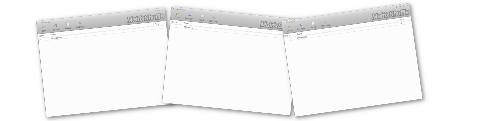

# MatrixShuffle

## What is MatrixShuffle?
MatrixShuffle - Is social network writed on C++ language licensed under MIT License where you can watch with other peoples random youtube videos.
## Features
This program now indev, and here is no features.
## Documentation
Documentation for MatrixShuffle you can find in DOCUMENTATION.md file.
## Building
To build MatrixShuffle you have to install
* C++ Compiler (Clang, G++, etc)
* CMake or Make build system
### Make
Now makefile is indev
### CMake
You have to clone this project and write this
```
mkdir Build
cd Build
cmake ..
make
```
---------------
Copyright (c) Mykyta Polishyk 2026